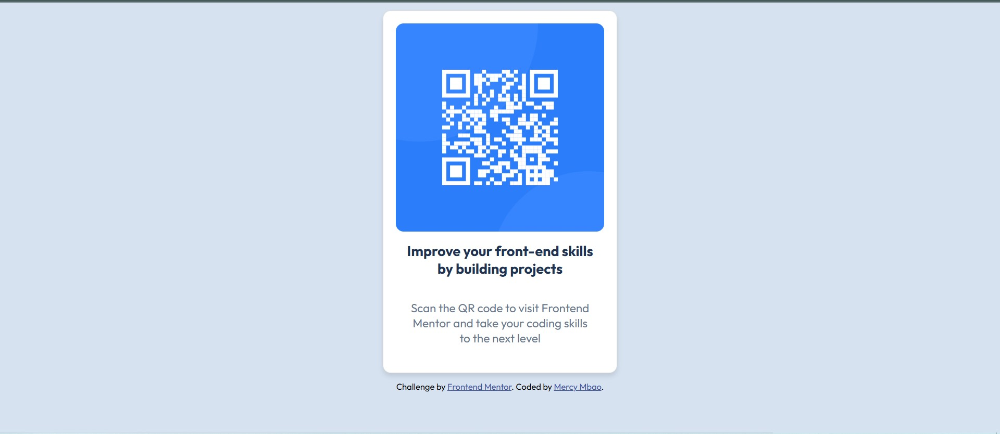

# Frontend Mentor - QR code component solution

This is a solution to the [QR code component challenge on Frontend Mentor](https://www.frontendmentor.io/challenges/qr-code-component-iux_sIO_H). Frontend Mentor challenges help you improve your coding skills by building realistic projects. 

## Table of contents

- [Overview](#overview)
  - [Screenshot](#screenshot)
  - [Links](#links)
- [My process](#my-process)
  - [Built with](#built-with)
  - [What I learned](#what-i-learned)
  - [Continued development](#continued-development)
  - [Useful resources](#useful-resources)
- [Author](#author)
- [Acknowledgments](#acknowledgments)


## Overview

### Screenshot




### Links

- Live Site URL: [netlify](https://enchanting-figolla-4edceb.netlify.app/)

## My process

### Built with

- Semantic HTML5 markup
- CSS custom properties
- Flexbox
- CSS Grid
- [Styled Components](https://styled-components.com/) - For styles


### What I learned

snippet code of what i have learned:
```css
/*proud-of-this-css*/
.card {
    background-color: hsl(0, 0%, 100%);
    width: 90%; /* Use percentage for responsiveness */
    max-width: 300px; /* Set a maximum width to prevent it from growing too large */
    margin: 10px auto; /* Center the card and add spacing */
    padding: 1rem;
    border-radius: 10px;
    overflow: hidden;
    box-shadow: 0 4px 6px rgba(0, 0, 0, 0.1);
    display: flex;
    flex-direction: column; /* Ensure content stacks vertically */
    border: 1px solid #ddd;
}

```


### Continued development
add user friendly animation


### Useful resources

- [w3schools](https://www.w3schools.com/) - Helped me in learning about semantics and css style components. I would recommend this for beginners


## Author

- Website - [mercy-mbao](https://enchanting-figolla-4edceb.netlify.app/)
- Frontend Mentor - [@mercie-ux](https://www.frontendmentor.io/profile/mercie-ux)
- Twitter - [@junearsenic7](https://www.twitter.com/junearsenic7)


## Acknowledgments

frontend mentor discord community

